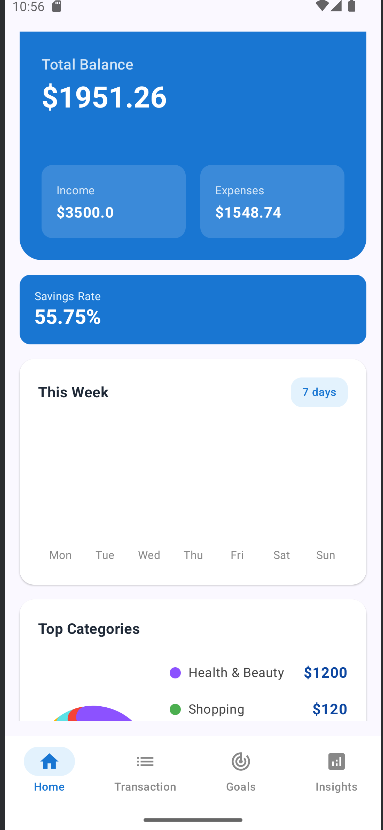
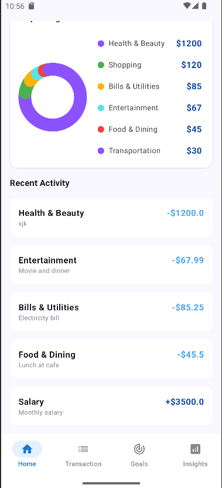
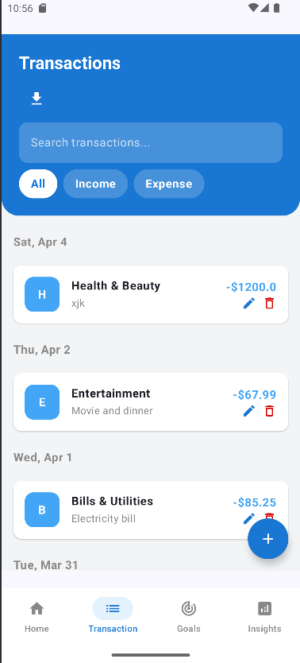
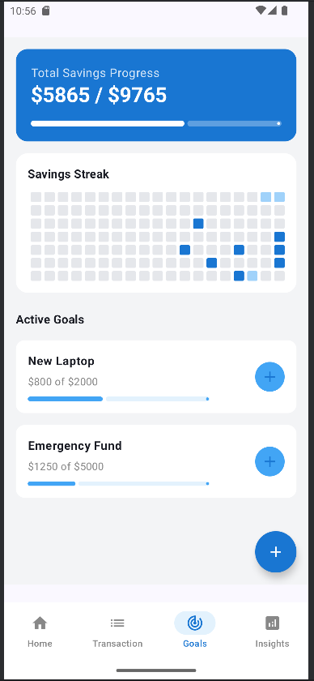
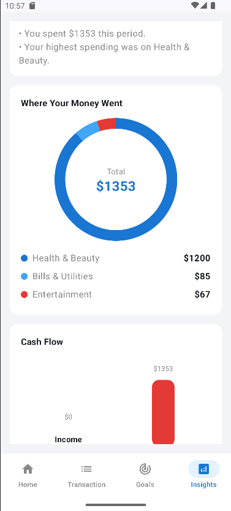
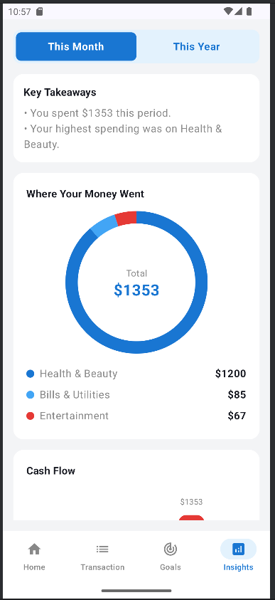

# Finance App

A modern, offline-first personal finance tracking application built natively for Android using Kotlin and Jetpack Compose. The application focuses on data privacy, local storage, and providing a clean, unified user interface.

## Technology Stack

* **UI Toolkit:** Jetpack Compose (Material Design 3)
* **Language:** Kotlin
* **Architecture:** MVVM (Model-View-ViewModel)
* **Dependency Injection:** Dagger Hilt
* **Local Database:** Room (SQLite)
* **Asynchronous Programming:** Kotlin Coroutines & StateFlow
* **Navigation:** Jetpack Navigation Compose
* **Security:** AndroidX Biometric Prompt

---

## Screenshots

<p align="center">
  
  
  
</p>

<p align="center">
  
  
  
</p>

## Architecture & Components

### 1. Home Dashboard Component
The entry point of the application that provides a high-level, immediate overview of the user's financial health. It aggregates data from various sources into unified visual elements.

* **Balance Summary:** A prominent header section displaying the total current balance, split into calculated monthly income and expenses.
* **Savings Rate Indicator:** A metric card that calculates and displays the user's current savings rate percentage.
* **Weekly Spending Chart:** A custom-built Jetpack Compose Canvas component displaying a responsive vertical bar chart of spending behavior over the trailing 7 days.
* **Top Categories Visualizer:** A custom-built Canvas donut chart that illustrates the distribution of expenses across different predefined categories (e.g., Food, Transport, Entertainment).
* **Recent Activity Feed:** A dynamically generated list showing the latest logged financial transactions, automatically color-coded to distinguish between income and expenses.

* ### 2. Transactions Component
A dedicated screen for viewing, filtering, and managing the user's complete financial ledger. This component is optimized for quick searching and precise data manipulation.

* **Unified Header UI:** Features a stylized, edge-to-edge primary blue header that houses the core search and filter controls, maintaining visual consistency with the Home Dashboard.
* **Smart Search:** Real-time text filtering that allows users to instantly find specific transactions based on categories or descriptive notes.
* **Quick Filters:** Interactive chip components ("All", "Income", "Expense") that instantly toggle the visibility of specific transaction types.
* **Chronological Grouping:** The transaction list dynamically groups entries by date (e.g., "Mon, Apr 6"), making it easier to parse historical spending patterns.
* **Actionable List Items:** Each transaction card displays color-coded amounts (indicating positive or negative cash flow) and includes swipe-to-reveal or inline actions for editing and deleting entries.
* **CSV Data Export:** Integrated with the Android Storage Access Framework (SAF), allowing users to safely generate and download their filtered transaction history as a `.csv` file directly to their local device storage without requiring invasive file permissions.

* ### 3. Goals & Savings Streak Component
A gamified and goal-oriented screen designed to encourage consistent saving habits. This component visually rewards user contributions and tracks progress toward multiple financial targets.

* **Master Progress Overview:** A prominent summary card that aggregates the total saved amount against the total target amount across all active goals, featuring a master progress bar.
* **Contribution Heatmap (Savings Streak):** A horizontally scrollable, GitHub-style contribution graph tracking the last 6 months (182 days) of saving activity. The grid automatically scrolls to the current date and uses color intensity to represent the volume of daily contributions.
* **Active Goals Tracker:** A dynamic list of ongoing financial goals. Each card displays the goal title, specific saved-versus-target amounts, and a dedicated linear progress indicator. Completed goals are automatically filtered out to maintain a clean UI.
* **Quick-Add Dialog:** Allows users to log contributions directly from the active goals list. It includes built-in "overfund protection," which dynamically calculates the remaining balance, displays it to the user, and disables the save button if the entered amount exceeds the goal's target.
* **Goal Creation:** An intuitive modal bottom sheet that allows users to quickly establish new financial targets by inputting a goal name and target amount.

* ### 4. Insights & Analytics Component
A comprehensive data visualization screen that transforms raw transaction data into actionable financial intelligence. Built entirely using custom Compose Canvas drawing, avoiding the bloat of third-party charting libraries.

* **Dynamic Timeframe Filtering:** A segmented toggle allowing users to instantly switch the analytical view between "This Month" and "This Year." The underlying database queries are optimized to fetch only transactions within these specific Unix timestamp boundaries.
* **Smart Key Takeaways:** An intelligent text summary section that dynamically calculates and highlights critical metrics, such as total period expenditure and the highest spending category.
* **Category Breakdown (Donut Chart):** A custom-drawn donut chart that visually distributes expenses across categories. It features a clean, flat-color design matching the app's theme, complete with a center total display and an accompanying sorted legend.
* **Cash Flow Comparison (Bar Chart):** A side-by-side vertical bar chart comparing total income against total expenses. It dynamically calculates proportions and scales its Y-axis based on the maximum value to provide an accurate visual representation of the user's cash flow.
* **Optimized Data Layer:** Utilizes Kotlin Flow and specialized Room queries to aggregate and process data directly within the database or efficiently in the ViewModel, ensuring smooth UI performance even with years of logged data.

* ## Project Structure & Architecture

This application strictly follows the Model-View-ViewModel (MVVM) architectural pattern. This ensures a clean separation of concerns among data handling, business logic, and user interface rendering.

Below is an overview of the core directory structure:

```text
FinanceApp/app/src/main/java/com/example/financeapp/
├── data/                  # MODEL LAYER
│   ├── local/             
│   │   ├── dao/           # Data Access Objects (GoalDAO, TransactionDAO)
│   │   ├── entity/        # SQLite Tables (FinancialTransaction, SavingGoal, etc.)
│   │   └── FinanceDatabase.kt
│   ├── models/            # Domain specific data classes
│   └── AppModule.kt       # Hilt Dependency Injection module
└── ui/                    # VIEW & VIEWMODEL LAYERS
    ├── features/          # Feature-based organization
    │   ├── goal/          
    │   │   ├── GoalScreen.kt      # View
    │   │   └── GoalViewModel.kt   # ViewModel
    │   ├── home/          
    │   ├── insight/       
    │   └── transaction/   
    ├── route/             # Navigation configurations
    ├── theme/             # Global styling (Colors, Typography)
    └── widgets/           # Reusable View components (Charts, UI States)
```

### Stateless UI & Route Pattern

To enforce strict separation of concerns within the presentation layer, the application utilizes a "Route-to-Screen" architectural pattern for every feature.

* **The Route (Stateful Wrapper):** Files like `HomeRoute.kt` or `GoalRoute.kt` serve as the entry points for the Jetpack Compose Navigation graph. They are responsible for retrieving the ViewModel via Dagger Hilt, collecting reactive `StateFlow` data into Compose state, and handling complex navigation events.
* **The Screen (Stateless UI):** Files like `HomeScreen.kt` or `GoalScreen.kt` contain purely stateless composable functions. They have absolutely no awareness of the ViewModel, data layer, or navigation controller. They exclusively accept raw data parameters and lambda callbacks for user interactions.

**Benefits of this architecture:**
* **Separation of Concerns:** State management and dependency injection are completely decoupled from UI rendering logic.
* **Enhanced Testability:** Stateless UI components can be easily tested in isolation by passing static mock data.
* **Reliable Previews:** Purely stateless components allow for immediate and reliable Android Studio `@Preview` rendering without requiring mock ViewModels or complex dependency injection setups.
